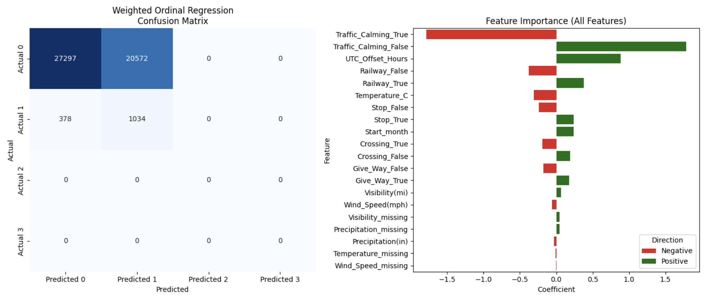

# Incident Severity Classification

## Problem Statement
The Canadian government is concerned about the growing number of traffic accidents. They’ve purchased a dataset from the US government and contracted you to generate insights into the impact of various factors on car accidents.

## Data Overview
Source: US Government Traffic Accident Dataset
Features: Road characteristics, weather conditions, traffic patterns, timestamps, accident severity, and location.
Target Variable: Accident severity (categorical: low vs high severity)
Dataset Size: 246633 rows, 47 columns
Key Feature Types:
    - Numeric: Traffic volume, temperature, wind speed, road length
    - Categorical: Road type, weather condition, time of day, region

## Key Assumptions
- Accident patterns in the US dataset are sufficiently representative to infer insights relevant to Canadian roadways.
- The features included capture the primary determinants of accident severity.
- Missing values and categorical inconsistencies have been handled appropriately during preprocessing.

## Approach

1. Data Cleaning & Preprocessing:
    - Handled missing values, removed duplicates, and standardized numeric features.
    - Encoded categorical variables using LabelEncoder or OneHotEncoder.

2. Exploratory Data Analysis (EDA):
    - Visualized accident frequency by road type, time of day, and weather.
    - Identified correlations and potential multicollinearity using VIF (Variance Inflation Factor).

3. Modeling:
    - Logistic Regression (including ordinal regression for severity ranking)
    - Random Forest Classifier
    - Ordinal Regression
    - Ordinal Regression with Class Weights

4. Evaluation:
    - Metrics: Accuracy, F1-score, Confusion Matrix
    - Feature importance analysis for model interpretability

## Results
- The models struggled to achieve high predictive performance due to dataset limitations, such as class imbalance in accident severity and missing key driver or traffic behavior features.
- While predictive accuracy is limited, the models are still useful for identifying relative risk factors, showing which conditions (e.g., weather, time of day, road type) are associated with higher accident likelihood.
- The outputs are better interpreted as a risk monitoring tool rather than a strict prediction system, highlighting areas and conditions that warrant closer attention.

## Business Interpretation
- Instead of providing precise accident predictions, the model can support risk monitoring and prioritization for safety initiatives.
- Authorities can use the identified risk factors to monitor high-risk conditions, allocate resources efficiently, and target preventive measures in areas with elevated risk.
- Insights from feature importance can guide policy planning and awareness campaigns, even without reliable predictive performance.
- Overall, the model serves as an early warning tool to focus attention on the factors most correlated with accidents, rather than as a definitive predictor of individual incidents.

## Limitations 
- Severe class imbalance: Only ~3% of accidents are severe; unweighted models overwhelmingly predict the majority class.
- Weak feature signal: Correlations with severity are very low (<0.1); current features explain little variance.
- Data quality issues: Missing values required imputation; some categorical encoding may reduce interpretability.
- Coarse severity labels: Only two levels (2 vs 4); real-world severity is more nuanced.
- Model constraints: Ordinal regression assumes monotonic effects; random forests are limited by sparse severe-class examples.

## Reccomendations & Next Steps
- Data enrichment: Add features on traffic, driver behavior, vehicle type; increase severe case coverage via multi-year or multi-region data.
- Modeling imbalance: Use class weighting or oversampling (e.g., SMOTE); consider binary “high-risk vs low-risk” framing.
- Evaluation metrics: Prioritize recall, F1-score, and macro metrics for severe accidents; use confusion matrices and cost-weighted evaluation.
- Interpretability & use: Weighted ordinal regression provides interpretable risk thresholds; use predictions as flags, not exact severity labels.

## Results

